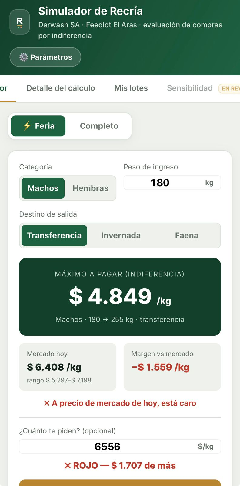
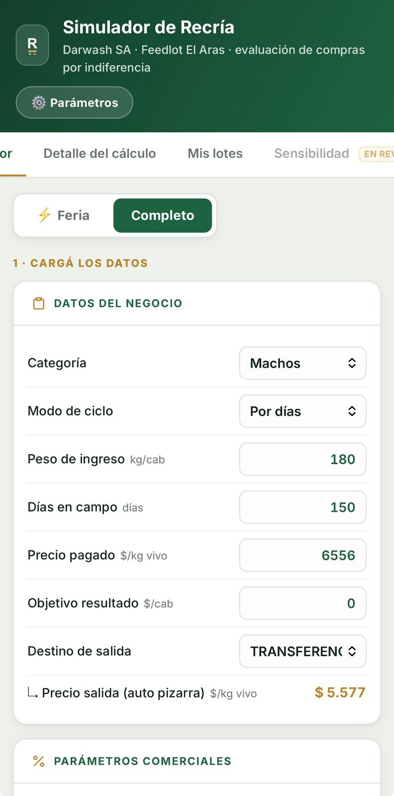
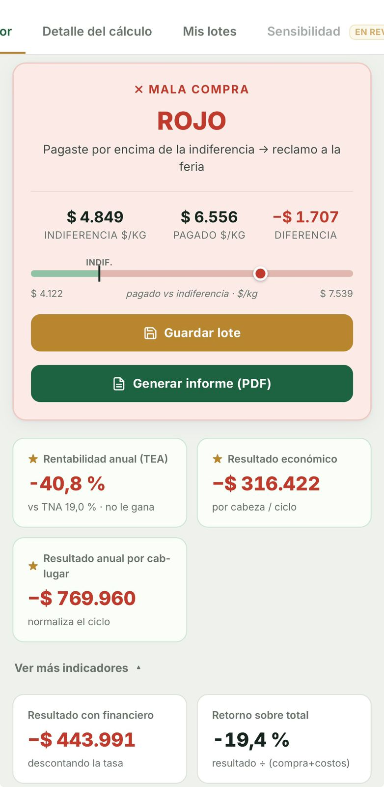
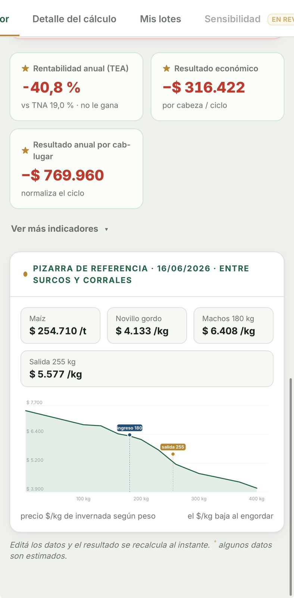
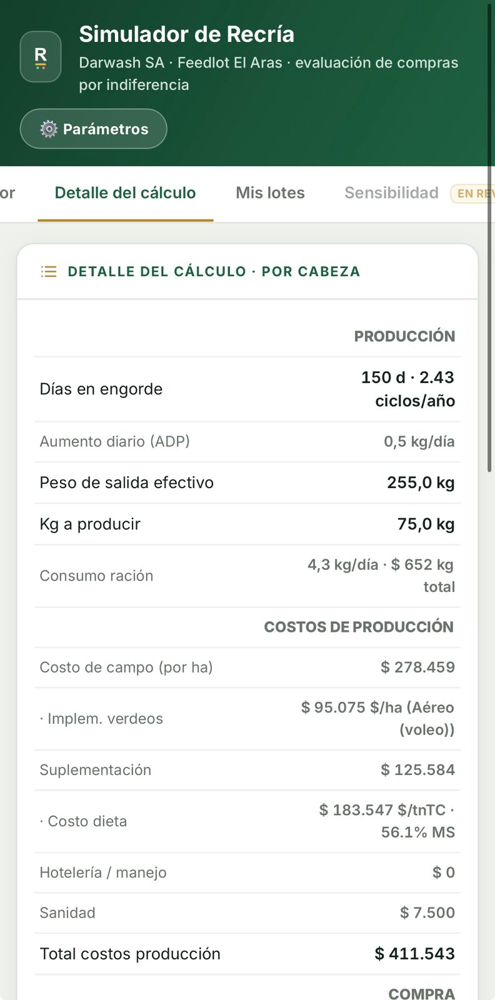
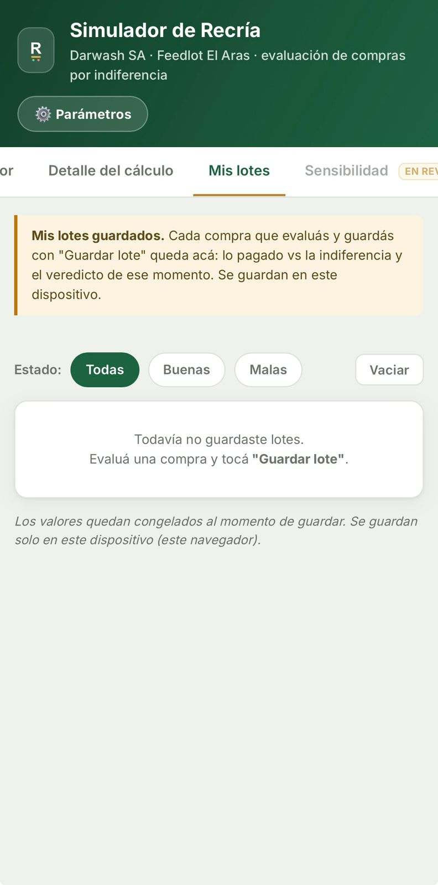

# Simulador de Recría — Darwash SA

App (PWA) para evaluar en la feria si conviene comprar un lote de terneros para **recría**, comparando el $/kg pagado contra el **precio de indiferencia** (punto de equilibrio).

El semáforo tiene **tres niveles**, usando dos umbrales: la **indiferencia de equilibrio** (resultado cero) y la **indiferencia de recupero (µ)** (máximo a pagar para que además recupere el capital al ritmo del plazo fijo × µ):

- **Verde** = se pagó por debajo de la indiferencia de recupero → cierra **y** le gana al plazo fijo (×µ). Buena compra.
- **Amarillo** = se pagó entre el recupero y el equilibrio → cierra, pero **no** le gana al plazo fijo (la plata rendiría parecido en un plazo fijo).
- **Rojo** = se pagó por encima del equilibrio → mala compra → reclamo a la feria.

El criterio es **indiferencia** (equilibrio + recupero de capital), NO un margen objetivo fijo.

Vive en: https://harambeiskappa.github.io/Simulador-Recria/

---

## Capturas

**Modo Feria** — categoría + peso + destino → máximo a pagar:



**Modo Completo** — datos del negocio, resultado (semáforo), indicadores y pizarra de referencia:

  

**Detalle del cálculo:**



**Mis lotes** — historial de compras evaluadas:



---

## A qué apunta

- **Uso en el ruedo, desde el celular** (modo *Feria*: categoría + peso → máximo a pagar, sin escribir precio).
- Que **casi todo sea auto-actualizable** (precios de mercado) — objetivo en curso.
- Excel como backend de datos (registro, control por carga). Está en la carpeta del proyecto, no en este repo.

---

## Cómo funciona el modelo

Alineado a la planilla de Nico (hojas **Invernada** y **Recria Capt**). Validado celda por celda.

**Indiferencia** = precio de compra que hace el resultado por cabeza = 0.

```
Resultado = (Venta neta − Compra neta) − Costos de producción [− Costo financiero]
```

### Todo por hectárea (clave del modelo)
El costo del campo se arma por hectárea/año y baja a la cabeza según la carga:

```
costo campo/ha/año = implem. verdeos + implem. pasturas/años + mantenimiento + (alquiler kg novillo × $/kg)
atot por cabeza = costo campo/ha/año ÷ carga (cab/ha) ÷ 365 × días en campo
```
- **Verdeos**: método de siembra **Aéreo (voleo)** o **Terrestre** → labor + semilla × precio × tipo de cambio (los insumos están en USD).
- La **carga** (cab/ha) es la palanca más fuerte: más carga → menos costo por cabeza.

### Suplementación (dieta de 3 insumos)
Maíz, silo y núcleo, ponderados por **receta (partes)** y **materia seca (%MS)**:
```
costo dieta $/tonTC = Σ(precio × partes) / Σ(partes)
stot por cabeza = pesoProm × consumoTC/PV × %suplementación × días de suministro × (costo dieta/1000) × (1 + markup)
```

### Dos modos de campo
- **Alquiler**: cascada por hectárea (arriba).
- **Capitalización**: el costo son los **kilos que entregás** = % de los kilos producidos × precio de salida (sin alquiler ni suplementación propia).

### Mortandad y desbaste
**Mortandad por ciclo** y **desbaste de venta** se descuentan de los kilos vendidos (como Nico), no como costo aparte.

### Capa comercial / impuestos / financiera
Comisiones (compra/venta), guías, fletes por km y kg/jaula, IVA, retención de ganancias (RG 830), costo financiero (tasa × días de financiamiento).

### Destinos
- **INVERNADA**: venta viva ($/kg de pizarra o manual).
- **FAENA**: carne × rinde.
- **TRANSFERENCIA**: a feedlot propio (precio de salida de pizarra).

---

## Pizarra de precios (`precios.json`)

La app lee `precios.json` al abrir y actualiza la pizarra y los parámetros de mercado.

| Dato | Fuente | Auto |
|---|---|---|
| Terneros / terneras / vaquillonas (por rango de kg) | Entre Surcos y Corrales | sí (semanal) |
| Maíz | BCR Rosario | sí |
| Novillo gordo / arrendamiento | Mercado Agroganadero Cañuelas | sí |
| Tipo de cambio | Dólar mayorista | sí |
| Silo / núcleo / semilla | Proveedor | manual (no cotizan público) |

---

## La app (PWA)

- Hosteada en **GitHub Pages**, instalable en iPhone/Android (pantalla completa, offline).
- **Service worker v4 "red primero"** para el index → las actualizaciones entran solas al reabrir (no hace falta reinstalar).
- **Flujo de actualización**: editar archivos → **Commit + Push** (GitHub Desktop) → la app se actualiza sola.
- **Modo Feria** (rápido: categoría + peso + destino → máximo a pagar, con rango máx/mín de la categoría) y **modo Completo** (simulador completo). El modo Feria refleja el destino y el modo de campo configurados.
- Botón **Generar informe (PDF)**: arma un informe de una carilla con el estilo de la app y lo comparte como archivo.
- Botón **Guardar lote**: guarda la evaluación actual (categoría, peso, destino, pagado, indiferencia, veredicto, fecha) en el dispositivo (`localStorage`), con los valores congelados al momento.
- Pestañas: **Simulador**, **Detalle del cálculo** y **Mis lotes** (historial de lotes guardados en el dispositivo, con filtro buenas/malas y resumen). **Sensibilidad** muestra la indiferencia según carga × suplementación. (La vieja "Análisis de compras" con datos de prueba se reemplazó por "Mis lotes".)

---

## Instalar la app (iPhone, Android, PC)

Link para compartir: **https://harambeiskappa.github.io/Simulador-Recria/**

**iPhone (Safari)** — debe ser Safari, en Chrome no aparece la opción:
1. Abrí el link en Safari.
2. Tocá **Compartir** (el cuadrado con la flecha ↑).
3. **Agregar a pantalla de inicio** → **Agregar**.

**Android (Chrome):**
1. Abrí el link en Chrome.
2. Menú **⋮** → **Instalar app** (o **Agregar a pantalla de inicio**).

**Windows (Chrome o Edge):**
1. Abrí el link.
2. En la barra de direcciones, ícono **Instalar** (monitor con flecha ↓), o menú **⋮ → Apps/Aplicaciones → Instalar este sitio como app**.

**Mac:**
- **Safari**: menú **Archivo → Agregar al Dock**.
- **Chrome**: ícono **Instalar** en la barra de direcciones → **Instalar**.

Una vez instalada queda con ícono propio, abre en pantalla completa y funciona sin internet. Las actualizaciones entran solas al reabrir (gracias al service worker "red-primero").

---

## Archivos del repo

| Archivo | Qué es |
|---|---|
| `index.html` | La app completa (HTML + CSS + JS en un solo archivo). |
| `sw.js` | Service worker (caché offline + red-primero). |
| `manifest.json` | Manifiesto PWA (nombre, ícono, colores). |
| `icon-*.png`, `apple-touch-icon.png` | Íconos de la app (R con barra dorada + semáforo). |
| `precios.json` | Pizarra de precios editable que la app lee. |

---

## Parámetros: básicos vs avanzados

- **Básicos** (panel ⚙, a la vista): modo de campo, carga de terneros, alquiler, aumento diario, mortandad, sanidad, tasa, método de siembra, % suplementación, días de suministro, precios maíz/silo/núcleo.
- **Avanzados** (plegados): financiero fino, números de siembra, receta y %MS de la dieta, comercial, flete, impuestos.

Los datos provisorios se marcan con un asterisco `*`.

---

## Pendiente de confirmar con Nico/Lolo

- Tasa anual (19% capital propio vs ~57% del archivo de Nico).
- Carga real de El Aras (cab/ha) — hoy en 1 (valor de prueba, bajo).
- Días de suministro reales de suplemento.
- Precios de silo, núcleo y semilla.
- Error en el Excel de Nico: mantenimiento usaba ×1,7 en vez de × tipo de cambio (corregido en el nuestro).

---

## Pendientes / próximos pasos (roadmap)

- **Auto-update real de precios** (pendiente): GitHub Action programado que lea las fuentes (Entre Surcos para hacienda, BCR maíz, Cañuelas novillo, dólar, y la **TNA de plazo fijo / FIMA**) y reescriba `precios.json` solo. Hoy el `precios.json` se actualiza a mano (Commit + Push). La **TNA FIMA** (tasa de plazo fijo, hoy ~19%) ya está en el feed; falta el scraping automático de la tasa vigente.
- **Validación contra las simulaciones de Nico** (en pausa, esperando que las pase) — comparar resultado e indiferencia caso por caso.
- **Input del "valor de Lolo"** (a definir): el valor que Lolo le pide cambiar a Nico en el portal; cuando esté la definición, se suma como input y se aplica en la fórmula.
- **Sincronizar "Mis lotes" entre dispositivos** (opcional): hoy es local al dispositivo; sincronizar requeriría un backend.
- **App standalone** (a futuro): el modelo (`calc`) es JS puro y portable; ver "Documentación técnica".

---

## Validación

Validado contra la planilla de Nico:
- Cascada por hectárea: **$363.701/cab** (= su celda K11).
- Dieta: **$183.547/tonTC** y **56,1% MS** (= C68/C58).
- Suplementación con markup: **$46.192/cab** (= C75).
- Capitalización: **$60.000/cab** (= su K11 de Recria Capt).
- Break-even exacto en 0. Indiferencia decrece monótonamente con el peso.

---

## Documentación técnica (para devs / IA / app standalone)

### Arquitectura
- **Un solo archivo `index.html`**: HTML + CSS (en `<style>`) + JS vanilla, sin frameworks ni build.
- 2 librerías externas por CDN, solo para el informe PDF: **jsPDF** y **html2canvas**.
- PWA: `sw.js` (caché + red-primero) y `manifest.json`.
- Tema "Pampa": verde `#13402c`/`#1f6242`, dorado `#b8862f`, semáforo verde `#1f8a4c` / rojo `#c0392b`. Fuente Inter.

### Estado global (objetos JS)
- **`NEG`** (datos del negocio, input del usuario): `categ` (Machos/Hembras), `modo` (Por días/Por peso), `ent` (peso ingreso kg), `sal` (peso salida kg, si Por peso), `dias_in` (días en campo, si Por días), `pag` (precio pagado $/kg), `objcab` (objetivo $/cab), `dest` (INVERNADA/FAENA/TRANSFERENCIA), `fuente` (CACG por kilo/ROSGAN índice/Manual), `psalin` (precio salida manual o $/kg carne), `rinde` (faena), `kmi`/`kms` (km compra/venta).
- **`PARAMS`** (supuestos). Defaults actuales:
  - Financiero: `tasa` 0.19, `base` "Compra + Costos", `plzc` 30, `plzv` 30.
  - Productivo/campo: `aum` 0.5, `mortc` 0.025 (por ciclo), `modoCampo` "Alquiler", `pctCapt` 0.30, `car` 1.0, `san` 7500, `hotel` 0.
  - Verdeos: `sieMet` "Aéreo (voleo)", `tcUSD` 1446, `semPr` 0.65, `labAv` 30, `semAv` 55, `labTe` 40, `semTe` 40.
  - Campo: `pastImpl` 368735, `pastDur` 4, `mant` 176900, `alqKg` 75, `alqNov` 4179.
  - Suplementación: `pctsupl` 0.40, `diasSupl` 0 (0 = todo el ciclo), `markupSupl` 0.05, `consMS` 0.028; dieta `pMaiz` 217761/`pSilo` 166257/`pNucleo` 409050, partes `rMaiz` 10/`rSilo` 85/`rNucleo` 5, `msMaiz` 87/`msSilo` 50/`msNucleo` 97.5.
  - Comercial/flete/impuestos: `comc` 0.03, `comv` 0.03, `gui` 1725, `desb` 0, `desbv` 0.05, `deco` 0, `tarifa` 3000, `cfijo` 0, `jcomp` 12000, `jvent` 19000, `ivavh` 0.105, `ivach` 0.105, `ivaf` 0.21, `ivas` 0.21, `mni` 224000, `alic` 0.02.
- **`PIZ`** (pizarra): `machos`/`hembras` = array de bandas `[pesoDesde, promedio, máx, mín]`; `rosgan`, `novillo`, `maiz` (números). Se completa desde `precios.json`.

### Función central `calc(N, P)` — devuelve todos los resultados
1. `dias`: Por días = `dias_in`; Por peso = `(sal−ent)/aum`.
2. `salef` (peso salida efectivo) = Por días: `ent+aum·dias`; Por peso: `sal`. `kgp = salef−ent`.
3. Fletes: `flei=(kmi·tarifa+cfijo)/jcomp`; `fles=(kms·tarifa)/jvent`.
4. Dieta: `costoDietaTon=Σ(precio·partes)/Σpartes`; `msDieta=Σ(%MS·partes)/Σpartes`; `consTCpv=consMS/(msDieta/100)`.
5. Verdeos: aéreo `(labAv+semAv·semPr)`, terrestre `(labTe+semTe·semPr)`, `×tcUSD` = `verdImpl`.
6. `campoHa = verdImpl + pastImpl/pastDur + mant + alqKg·alqNov`.
7. `psal` ($/kg salida): FAENA=`psalin·rinde`; TRANSFERENCIA=`vlook(salef)`; INVERNADA=según fuente (Manual=`psalin`, ROSGAN=`PIZ.rosgan`, CACG=`vlook(salef)`).
8. **Modo campo**: Capitalización → `atot=kgp·pctCapt·psal` y `stot=hot=san=0`. Alquiler → `atot=campoHa/car/365·dias`; `stot=pesoProm·consTCpv·pctsupl·díasSuministro·(costoDietaTon/1000)·(1+markup)`; `hot=dias·hotel`. `díasSuministro = diasSupl>0 ? diasSupl : dias`.
9. `cp = atot+stot+hot+san` (costos de producción).
10. Compra: `cnkg=pag·(1+desb+comc)+flei`; `cn=cnkg·ent`.
11. Venta: `kgv=salef·(1−mortc)·(1−desbv)` (mortandad por ciclo + desbaste descontados de los kilos); `gv` (gastos venta, 0 en TRANSFERENCIA)=`psal·(comv+deco)+fles+gui/kgv`; `vnkg=psal−gv`; `vn=vnkg·kgv`.
12. **Resultado** = `vn − cn − cp`.
13. Financiero: `díasFin=max(0,dias−plzc+plzv)`; `rf=tasa/365·díasFin`; `fin=rf·capitalBase` (base = cn, o cn+cp); `rescf=res−fin`.
14. **Indiferencia** = `((vn−cp)/ent − flei)/(1+desb+comc)` (la mortandad/desbaste ya están en `kgv`). Variantes: `indifcf` (con financiero), `indifobj` (con objetivo $/cab).
15. Indicadores: `TEA=(1+res/(cn+cp))^(365/dias)−1`; `resanual=res·365/dias`; `costokg=cp/kgp`; `relrepo=pag/psal`; puntos de equilibrio `ventaInd`, `racionInd`.
16. **Recupero de capital (µ)**: `rmu = tnaFima · µ · días/365`; `CI = cn+cp` (capital inmovilizado); `objMu = CI·rmu` (ganancia objetivo); `indifMu = (vn/(1+rmu) − cp)/ent/(1+desb+comc) − …` (máx a pagar para recuperar el capital + la tasa). `tnaFima` = TNA de fondos FIMA (money market); `µ` la ajusta a la recría.

`vlook(w,tabla)` interpola el promedio por el punto medio de cada banda. `bandOf(w,tabla)` devuelve la banda completa (para máx/mín en Feria).

### Funciones de UI (usan NEG/PARAMS/PIZ globales)
`renderNegocio`/`renderComercial` (forms), `renderParams` (panel ⚙: `PBASIC` visibles + `PADV` en `<details>`), `renderAll` (resultado/semáforo + KPIs 3+«ver más» + pizarra + detalle + Mis lotes + sensibilidad), `renderQuick`/`updateQuick` (modo Feria), `setMode("rapido"/"completo")`, `renderDetalle`, `renderPiz`/`curveSVG`, `renderBacktest` (Mis lotes), `renderSens`, `gaugeSVG`, `kpi`/`chip`/`pfield` (helpers), formato `f0`/`f0p`/`f1`/`fp`.

### Mis lotes (localStorage)
Clave `recriaLotes` → array de `{f (fecha), cat, ent, sal, dest, pag, indif, dif, estado}` con valores **congelados** al guardar. Funciones: `saveLote`, `loadLotes`, `persistLotes`, `delLote`, `clearLotes`.

### Informe PDF
`generateReport()` arma un nodo HTML con el estilo de la app → `html2canvas` (imagen) → `jsPDF` (A4) → `navigator.share` (archivo) o descarga.

### Auto-update (`precios.json`)
`{ fecha, machos:[[peso,prom,máx,mín]…], hembras:[…], rosgan, novillo, novilloArr, tcUSD, tnaFima, maiz, pMaiz, pSilo, pNucleo }`. La app lo lee al abrir (`fetch` no-store) y actualiza la pizarra (`PIZ`) **y** los parámetros de mercado (`tcUSD`, `alqNov` desde `novilloArr`, y los precios de la dieta `pMaiz`/`pSilo`/`pNucleo`). Es el único lugar donde se editan los precios.

### PWA
`sw.js` (CACHE `recria-v4`): `index.html` y `precios.json` = **red-primero** (siempre lo último, cae a caché sin internet); resto = caché-primero con guardado oportunista (cachea jsPDF/html2canvas tras el primer uso). Al cambiar `index.html` no hace falta reinstalar; al cambiar `sw.js`, subir el número de versión.

### Notas para una app standalone (futuro)
- El modelo (`calc`) es **JS puro sin dependencias del DOM**: se puede portar tal cual a React Native / Flutter reescribiendo solo la UI.
- "Mis lotes" es local (localStorage); sincronizar entre dispositivos requeriría un backend.
- La pizarra se actualiza por archivo; para auto-update real haría falta un scraper de Entre Surcos (la página renderiza con JS, requiere navegador headless) que escriba `precios.json`.

### Última auditoría (17/06/2026)
Código sin referencias rotas y JS válido. Tests del modelo: break-even = 0; indiferencia monótona con el peso; modos Alquiler/Capitalización OK; los 3 destinos coherentes (Invernada < Transferencia por gastos de venta; Faena no cierra desde terneros comprados); cascada por ha y dieta validadas contra la planilla de Nico. Modo Feria usa el mismo `calc` que Completo.

---

## Registro de cambios (changelog)

La versión actual se muestra en la cabecera de la app (`v1.x`). La más nueva, arriba.

- **v1.7** (22/06/2026) — **El coeficiente µ ahora impacta el veredicto: semáforo de 3 niveles.** Antes µ solo movía indicadores secundarios; el semáforo principal y el modo Feria seguían usando solo la indiferencia de equilibrio (µ "no se veía"). Ahora el veredicto usa dos umbrales — **verde** (pagado ≤ indiferencia de recupero µ: cierra y le gana al plazo fijo ×µ), **amarillo** (entre recupero y equilibrio: cierra pero no le gana al plazo fijo) y **rojo** (por encima del equilibrio: reclamo). El modo Feria muestra el máximo de equilibrio **y** el de recupero (µ), trae su propio campo µ y el plazo fijo × µ anual, y el medidor del cuadro de resultado se mide contra el recupero. El KPI de TEA y el informe PDF comparan contra **plazo fijo × µ** en lugar de la tasa genérica. (Además: se reparó el archivo maestro `Simulador_Recria_Darwash.html`, que había quedado truncado al final de `renderSens`.)
- **v1.6** (18/06/2026) — **Recupero de capital (coeficiente µ), reemplaza el objetivo manual.** El antiguo "Objetivo de resultado ($/cab)" se reemplazó por el coeficiente **µ**: el objetivo ahora se calcula solo = capital inmovilizado (compra + costos) × **TNA FIMA × µ** × días/365. La TNA FIMA es la tasa de los fondos money market / plazo fijo; µ la ajusta a lo que se le exige a la recría. En el formulario se carga µ y debajo aparece el objetivo en $/cab calculado; la "Indiferencia objetivo" pasó a ser la **indiferencia de recupero** (máximo a pagar para recuperar el capital + esa tasa). `µ` en el negocio; `tnaFima` editable y por el feed `precios.json`.
- **v1.5** (18/06/2026) — Todos los precios desde un solo `precios.json`: ahora el feed también trae los insumos de la dieta (maíz puesto, silo, núcleo), no solo la pizarra. Editás un archivo y se actualiza todo (pizarra + costo de suplementación). La fuente de precio de salida pasó a llamarse **"Entre Surcos (por kg)"** (antes "CACG por kilo"), que es de donde sale.
- **v1.4.3** (17/06/2026) — Fix del gráfico de la pizarra y el medidor en modo oscuro (el área bajo la curva y el fondo de la grilla tenían color claro fijo); ahora se adaptan al tema y se refrescan al cambiar de modo.
- **v1.4.2** (17/06/2026) — Más fixes de contraste en modo oscuro: encabezados de tablas, tarjetas de indicadores destacadas y el texto de los carteles informativos tenían fondo/color claro fijo; ahora se adaptan al tema oscuro.
- **v1.4.1** (17/06/2026) — Fix de contraste: en modo oscuro los desplegables (selects) tenían el texto casi invisible (fondo claro fijo). Los campos ahora usan fondo oscuro y texto legible en modo oscuro.
- **v1.4** (17/06/2026) — **Modo oscuro** (botón en la cabecera, recuerda la preferencia y respeta la del sistema) + ajustes de legibilidad (inputs a 16px para evitar el zoom del celular y leer mejor).
- **v1.3** (17/06/2026) — Versión visible en la app + botón **Actualizar** (fuerza el chequeo de nueva versión en apps ya instaladas); **aviso de pizarra desactualizada** (si tiene más de 10 días); **recuerda los últimos datos** cargados (localStorage); **atajos de peso** en modo Feria.
- **v1.2** (17/06/2026) — Capturas + guía de instalación + documentación técnica + roadmap en el README. Defaults realistas (carga 3, suplementación 30 días) + aviso "preliminar". Sensibilidad reconvertida (indiferencia según carga × suplementación). Exportar "Mis lotes" a CSV.
- **v1.1** (17/06/2026) — Modo Feria (categoría/peso/destino → máximo a pagar) con rango máx/mín; parámetros básicos/avanzados; informe PDF; KPIs jerarquizados; "Guardar lote" + pestaña "Mis lotes" (reemplaza la demo "Análisis de compras").
- **v1.0** (16/06/2026) — Base: cascada de costo por hectárea (verdeos voleo/avión + pasturas + mantenimiento + alquiler), dieta de 3 insumos con markup y días de suministro, modos Alquiler/Capitalización, mortandad por ciclo + desbaste, pizarra Entre Surcos, PWA instalable (GitHub Pages).

---

## Regla del proyecto (importante)

**Este README se actualiza con cada cambio del simulador** (qué se agrega, saca o modifica). Es la base de contexto para retomar el trabajo y para asistentes de IA (Copilot). Mantenerlo al día es obligatorio.

_Versión actual: **v1.6**. Cambios registrados por versión en el changelog. Última actualización: 18/06/2026 — indiferencia por recupero de capital (coef. µ sobre TNA FIMA); precios unificados en `precios.json`; fuente "Entre Surcos (por kg)". (Histórico: sección Capturas + guía de instalación (iOS/Android/PC) + changelog; documentación técnica completa (modelo, datos, funciones, PWA, notas para standalone) + auditoría integral; KPIs jerarquizados (3 principales visibles + "Ver más indicadores"); "Guardar lote" + pestaña "Mis lotes" (registro en el dispositivo) reemplazando la "Análisis de compras" de prueba; selector de destino en modo Feria con rango máx/mín de Entre Surcos; parámetros básicos/avanzados; informe PDF; cascada por hectárea; dieta de 3 insumos; modos alquiler/capitalización. La pizarra (`precios.json`) guarda por banda [peso, prom, máx, mín].)_
